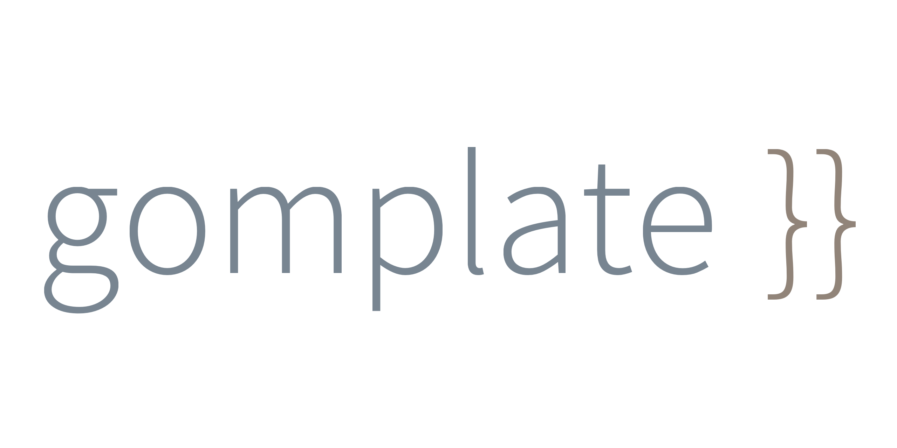

[](https://chocolatey.org/packages/gomplate)
[](https://chocolatey.org/packages/gomplate)





# Usage

To install `gomplate` and get an optimal experience on windows, just:

- [x] Follow classic choco [instructions](https://chocolatey.org/packages/gomplate/) to install/upgrade
- [x] :newspaper: Follow [gomplate on Twitter](https://twitter.com/gomplate)
- [x] :star: Star and follow [gomplate](https://github.com/hairyhenderson/gomplate) on Github
- [x] :book: Read the [`gomplate` documentation](https://docs.gomplate.ca/)
- [x] :smiley_cat: Enjoy

# For developers only section

# Compute `sha256` checksum

```
certUtil -hashfile tools/gomplate_windows-amd64.exe SHA256
```


## Build locally


```
git clone https://github.com/adriens/gomplate.git
cd chocolatey-gomplate
choco uninstall gomplate
choco install -fdv gomplate.nuspec
```


## Release check list


## Deploy to central

```
choco push gomplate.3.9.0.nupkg --source https://push.chocolatey.org/ -apikey *******
```
